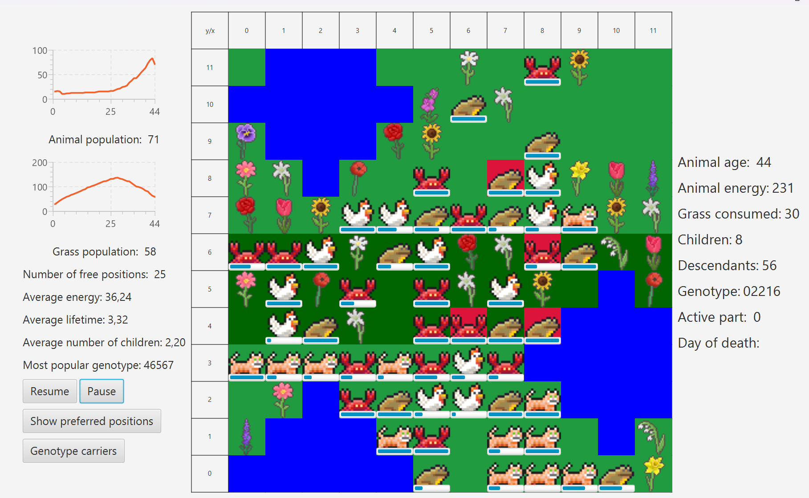

# Darwin simulation

#### This project is a Java application that simulates life cycle of animals inspired by Darwin's theory of evolution. GUI was built in JavaFX, tests were implemented with jUnit.

Authors:

## Menu

#### Users can enter their own values for map parameters, save their current config, and decide to save simulation stats to a CSV file. There is input validation.

## Simulation

## 1. General description

#### Each day animals eat grass, they move based on their random genotype, and they reproduce. There are water reservoirs that grow and shrink in a cycle posing threat to animals and grass. Energy bars show how much time animals have left. When animals get older, they gradually stop moving (if Old not gold was selected in menu).

## 2. Statistics

#### Multiple data is being tracked for the simulation, you can click on a particular animal to inspect their stats.

#### You can show preferred positions for grass to grow.

#### Animals with red background are carriers of the most popular genotype.

#### Both features can be turned on/off with buttons on the left.

## 3. Multithreading

#### Multiple simulations can happen simultaneously thanks to multithreading.
